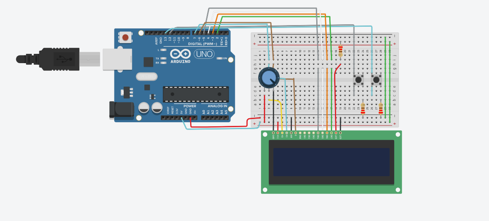
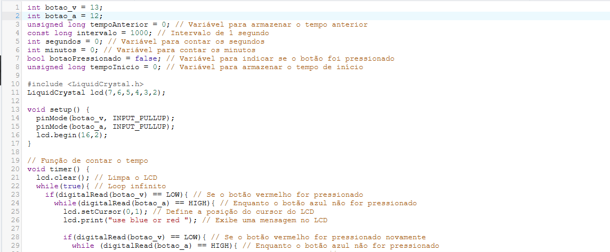
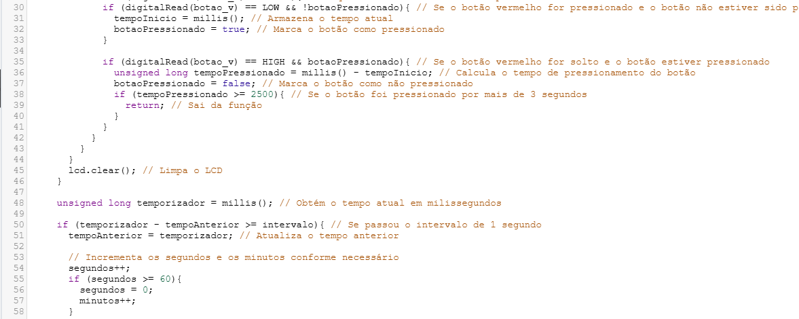
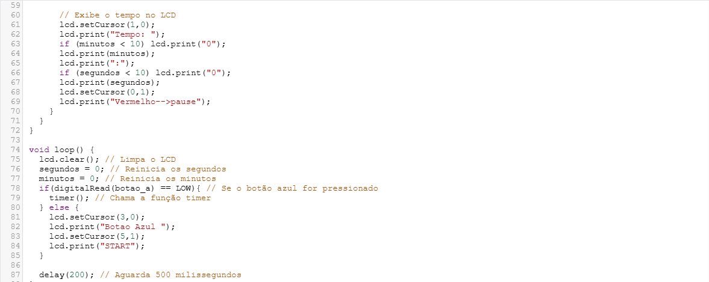

 

# Projeto TANGRAM - ARANOUÁ

Projeto Tangram com Arduino e Peças em 3D

Este projeto, desenvolvido pela equipe do ARANOUÁ em parceria entre o IFAM (Instituto Federal do Amazonas), a Samsung e a FAEPI (Fundação de Amparo à Educação e Pesquisa do Amazonas), visa proporcionar uma experiência educativa e divertida para crianças na faixa etária de 10 anos, especificamente alunos do quinto ano.

O Tangram é um quebra-cabeça chinês tradicional composto por sete peças geométricas. Nossa abordagem combina a tradição do Tangram com a tecnologia moderna, utilizando peças impressas em 3D e um sistema eletrônico baseado em Arduino para criar uma experiência interativa e educativa.

As peças do Tangram são projetadas em 3D para facilitar a manipulação e a visualização das formas geométricas pelos alunos. Além disso, o Arduino é utilizado para criar interações divertidas, como feedback visual quando as peças são corretamente posicionadas para formar diferentes figuras.

O Arduino também desempenha um papel importante na temporização do tempo que cada indivíduo leva para montar o Tangram. Com as funcionalidades de Start, Pause e Reset, os alunos podem iniciar o tempo quando começarem a montagem, pausá-lo se necessário e reiniciá-lo conforme desejado. Isso adiciona um elemento de desafio e competição ao projeto, incentivando os alunos a melhorarem suas habilidades de resolução de problemas e coordenação motora.

Este projeto visa não apenas ensinar conceitos de geometria e resolução de problemas, mas também promover a criatividade, a colaboração e o pensamento crítico entre os alunos.

### Esquema Arduino - Tinkercad 

-----------------------------------------------------------------------------------------------------------------

### Vídeo Arduino - Tinkercad 

https://github.com/user-attachments/assets/9d984068-8d0d-4657-b1f0-41fdffd8c900

-----------------------------------------------------------------------------------------------------------------

### Algoritmo Arduino - TinkerCad 01

### Algoritmo Arduino - TinkerCad 02

### Algoritmo Arduino - TinkerCad 03

### II Mostra de Projetos da Formação Educadores do Século 21

